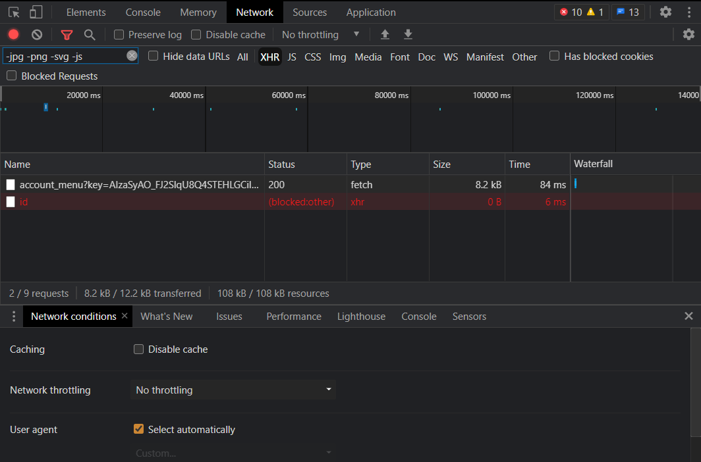

# yt2009relay
for use with the 2009 frontend, if you have access.

---

## setup
- install node.js if you don't have it already
- in your repo directory, rename **example-config.json** to **config.json**
- fill out your config.
	---
	- **youtube cookie**:
		- open youtube signed in, open devtools.
		- go to the **Network** tab at the top, click **XHR** a bit below as a filter option.
		- click a link on the site, like your account menu.
		* if everything went right, your devtools should look like this: 
		- click on the request that was completed (in this case `account_menu?key=...`)
		- make sure you are on the Headers tab, scroll down until you see a **Cookie** header in the **Request Headers** dropdown.
		- right click the **Cookie** content and press **Copy**/**Copy value**. __DO NOT CTRL+C!__
		
		(if using Firefox, make sure you remove the leading `Cookie: ` from the copied value)

		### **don't share your cookie with anyone! they can use it to access your yt account.**
	---
	- **useragent** - the User Agent Identifier that should be passed to youtube requests.
		- the default one corresponds to **Firefox 102** on **Windows 10**. it can be left there or changed if needed. 
	---
	- **domain** - the domain name where the frontend is hosted.
		- no http(s), no port, just the domain name.
		- or the IP address if no domain is used.
	---
- open a terminal in your working directory
- type the following command to install the required dependencies: `npm install`
- followed by `node yt2009relay.js` to start the relay.

**next time, you'll only need the second command to start relay.**

- once the relay is done setting up, go to /relay/link.htm to link the frontend to your relay.